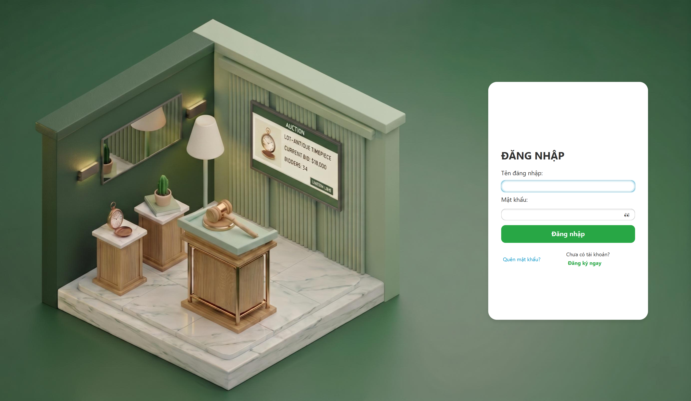
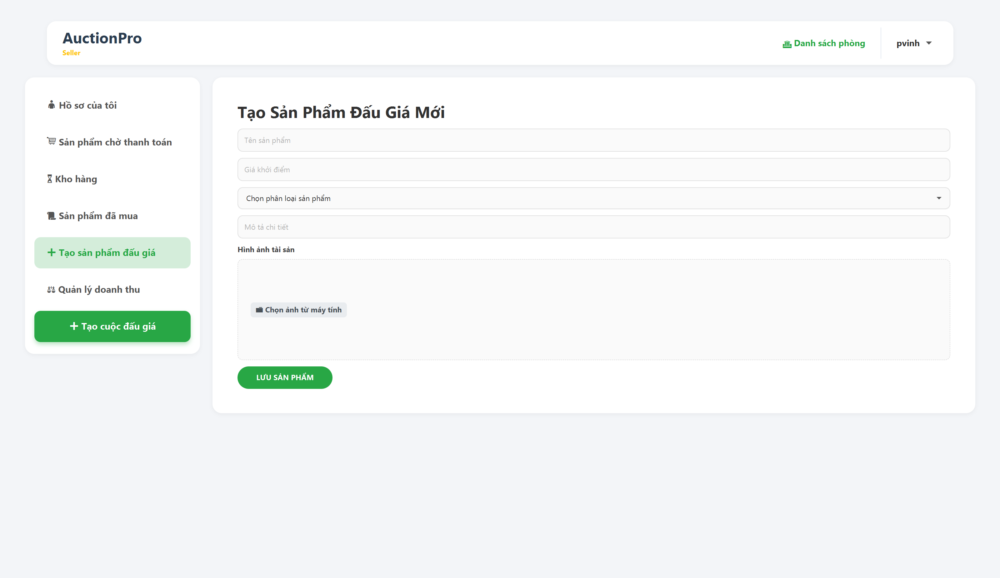
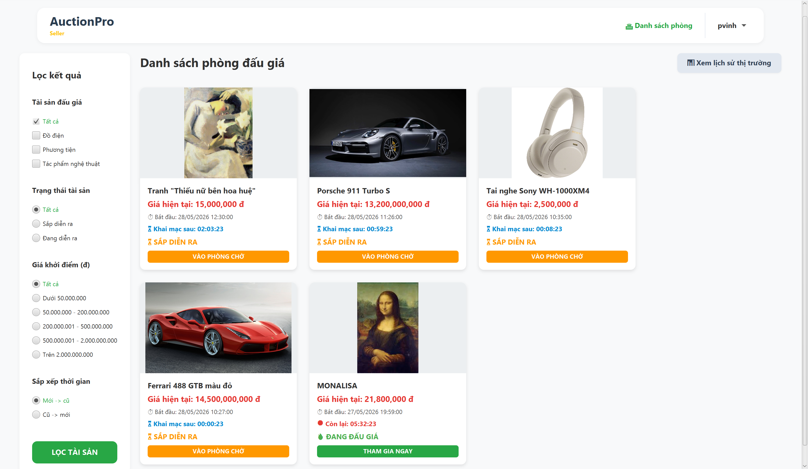
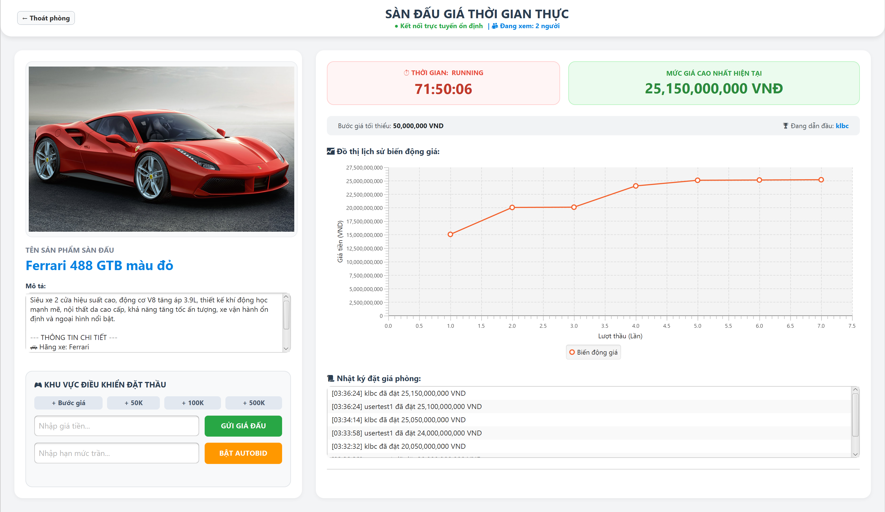
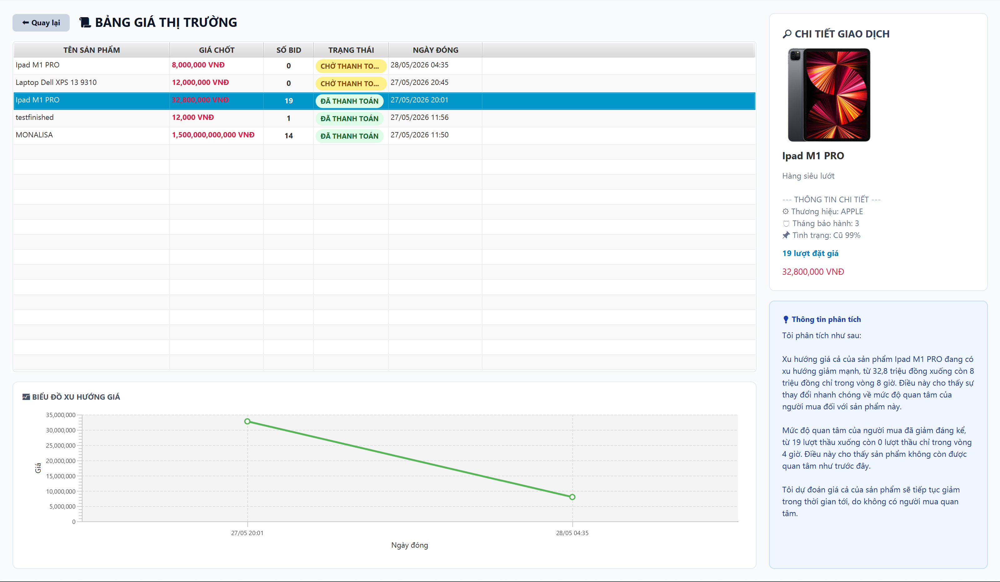
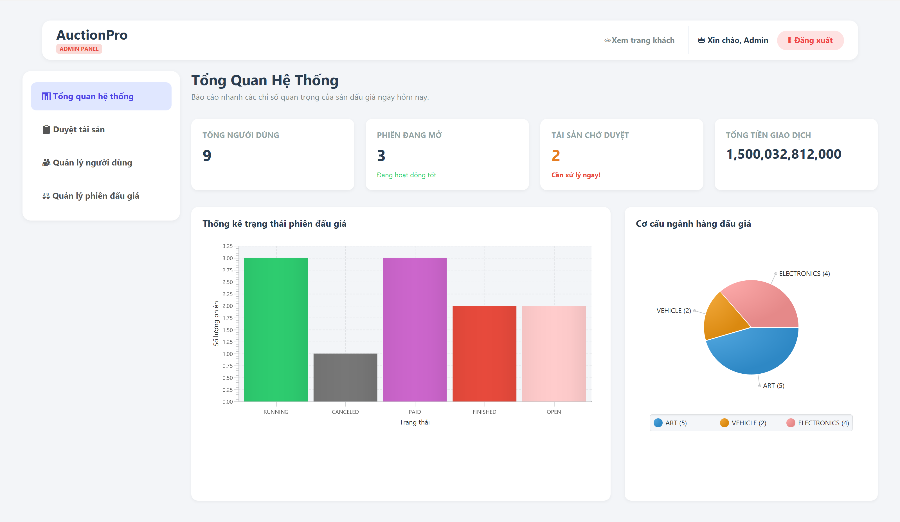

# Online Auction Platform

[](https://www.java.com/)
[](https://openjfx.io/)
[](https://maven.apache.org/)
[](https://www.mysql.com/)
[](https://groq.com/)

## Tổng quan

**Online Auction Platform** là hệ thống đấu giá trực tuyến được xây dựng bằng Java, áp dụng mô hình **Client-Server**, giao tiếp qua **TCP Socket**, giao diện người dùng bằng **JavaFX**, lưu trữ dữ liệu bằng **MySQL Cloud Database** và tích hợp một số chức năng hỗ trợ bằng **AI**.

Dự án được phát triển trong khuôn khổ **Bài tập lớn môn Lập Trình Nâng Cao**, tập trung vào các vấn đề kỹ thuật chính:

- Xử lý nhiều client kết nối đồng thời.
- Đồng bộ quá trình đặt giá trong thời gian thực.
- Đảm bảo tính nhất quán dữ liệu khi đấu giá, thanh toán và chuyển quyền sở hữu tài sản.
- Áp dụng lập trình hướng đối tượng, kế thừa, đa hình và tổ chức hệ thống theo module.
- Tích hợp AI để hỗ trợ kiểm duyệt vật phẩm và phân tích dữ liệu đấu giá.

### Phạm vi hệ thống


- **Ứng dụng Server:** xử lý kết nối client, nghiệp vụ đấu giá, ví điện tử, AutoBid, AI và Database.
- **Ứng dụng Client:** cung cấp giao diện JavaFX cho người dùng tham gia đấu giá.
- **Core Module:** chứa các model, DTO và thành phần dùng chung giữa client và server.
- **Cơ sở dữ liệu:** lưu trữ tài khoản, vật phẩm, phiên đấu giá, giao dịch và thông tin ví điện tử.
- **Tích hợp AI:** hỗ trợ admin kiểm duyệt vật phẩm và hỗ trợ client phân tích dữ liệu lịch sử thị trường.


---

## Mục lục

- [Tổng quan](#tổng-quan)
- [Chức năng đã hoàn thành](#chức-năng-đã-hoàn-thành)
- [Công nghệ sử dụng](#công-nghệ-sử-dụng)
- [Kiến trúc hệ thống](#kiến-trúc-hệ-thống)
- [Cấu trúc dự án](#cấu-trúc-dự-án)
- [Hướng dẫn cài đặt và chạy hệ thống](#hướng-dẫn-cài-đặt-và-chạy-hệ-thống)
- [Tài khoản demo](#tài-khoản-demo)
- [Hướng dẫn sử dụng](#hướng-dẫn-sử-dụng)
- [Hình ảnh minh họa](#hình-ảnh-minh-họa)
- [Báo cáo và video demo](#báo-cáo-và-video-demo)
- [Thành viên nhóm](#thành-viên-nhóm)
- [Ghi chú](#ghi-chú)

---

## Chức năng đã hoàn thành

### 1. Xác thực và phân quyền người dùng

- Đăng ký và đăng nhập tài khoản người dùng.
- Mã hóa mật khẩu một chiều bằng **jBCrypt**.
- Phân quyền người dùng theo vai trò.
- Hỗ trợ cơ chế nâng cấp quyền tài khoản.
- Quản lý phiên đăng nhập và trạng thái kết nối client.

### 2. Đấu giá thời gian thực

- Người dùng có thể tham gia các phiên đấu giá đang mở.
- Hệ thống xử lý nhiều yêu cầu đặt giá từ nhiều client khác nhau.
- Cơ chế đồng bộ giúp hạn chế race condition trong quá trình bidding.
- Cập nhật trạng thái đấu giá và mức giá hiện tại cho client.
- Xác định người chiến thắng khi phiên đấu giá kết thúc.

### 3. Đấu giá tự động AutoBid

- Người dùng có thể thiết lập cơ chế đặt giá tự động.
- Hệ thống tự động tính toán mức giá tiếp theo dựa trên quy tắc đấu giá.
- AutoBid cạnh tranh giá thay người dùng trong giới hạn cho phép.
- Hỗ trợ kiểm tra số dư và điều kiện hợp lệ trước khi đặt giá tự động.

### 4. Quản lý ví điện tử và giao dịch

- Quản lý ví điện tử của người dùng.
- Kiểm tra số dư trước khi đặt giá.
- Xử lý khoản tiền liên quan đến phiên đấu giá.
- Tự động thanh toán khi người dùng thắng phiên đấu giá.
- Chuyển quyền sở hữu vật phẩm sau khi phiên đấu giá kết thúc.

### 5. Quản lý tài sản đấu giá

- Quản lý các loại tài sản khác nhau trong hệ thống.
- Áp dụng kế thừa và đa hình cho các nhóm vật phẩm như:
  - Art
  - Electronics
  - Vehicle
- Mỗi loại tài sản có thể có thuộc tính riêng nhưng vẫn dùng chung logic quản lý cơ bản.

### 6. Tích hợp AI

Hệ thống tích hợp AI thông qua Groq API để hỗ trợ một số chức năng nâng cao:

- **AI Moderation dành cho Admin**
  - Hỗ trợ đánh giá tính hợp lệ của vật phẩm.
  - Gợi ý hoặc nhận xét về thông tin vật phẩm.
  - Hỗ trợ đề xuất giá khởi điểm.

- **AI Analytics dành cho Client**
  - Phân tích dữ liệu đấu giá.
  - Đưa ra nhận xét về xu hướng hoặc hành vi đấu giá.
  - Hỗ trợ người dùng tham khảo trước khi tham gia đấu giá.

> AI trong dự án đóng vai trò hỗ trợ ra quyết định, không thay thế hoàn toàn quyền kiểm duyệt của admin hoặc logic nghiệp vụ chính của hệ thống.

---

## Công nghệ sử dụng

| Nhóm công nghệ       | Công nghệ                        |
|----------------------|----------------------------------|
| Ngôn ngữ lập trình   | Java (25+)                       |
| Giao diện người dùng | JavaFX, FXML, CSS                |
| Công cụ build        | Maven                            |
| Kiến trúc            | Client-Server, MVC, Multi-module |
| Kết nối mạng         | TCP Socket                       |
| Định dạng dữ liệu    | JSON                             |
| Cơ sở dữ liệu        | MySQL Cloud Database             |
| Truy cập dữ liệu     | JDBC                             |
| Mã hóa mật khẩu      | jBCrypt                          |
| Tích hợp AI          | Groq API, LLaMA 3.3              |
| Đóng gói             | Fat JAR                          |

---

## Kiến trúc hệ thống

Dự án được thiết kế theo mô hình **Client-Server** và tổ chức theo kiến trúc **Maven Multi-module**.

```txt
Client Application  <---- TCP Socket / JSON ---->  Server Application  <---- JDBC ---->  MySQL Cloud Database
        |                                               |
     JavaFX UI                                      Business Logic
        |                                               |
   User Actions                                 Auction / Wallet / AI
```

### Core Module

Core module chứa các thành phần dùng chung giữa Client và Server:

- DTO truyền dữ liệu giữa client và server.
- Các entity/model cốt lõi.
- Định nghĩa các kiểu request/response.
- Factory Pattern cho các loại tài sản khác nhau.
- Các class hỗ trợ đóng gói và xử lý dữ liệu chung.

### Server Module

Server là trung tâm xử lý nghiệp vụ của hệ thống.

Các thành phần chính:

- `network`
  - Quản lý kết nối client.
  - Tạo và điều phối các luồng xử lý thông qua `ClientHandler`.
  - Nhận request từ client và trả response tương ứng.

- `services`
  - Xử lý nghiệp vụ đấu giá.
  - Quản lý AutoBid.
  - Xử lý ví điện tử và giao dịch.
  - Tích hợp AI moderation và AI analytics.
  - Kiểm soát logic chuyển quyền sở hữu vật phẩm.

- `daos`
  - Truy xuất dữ liệu thông qua JDBC.
  - Làm việc với MySQL Cloud Database.
  - Thực hiện các thao tác CRUD và truy vấn nghiệp vụ.

### Client Module

Client cung cấp giao diện người dùng bằng JavaFX.

Các thành phần chính:

- Giao diện FXML và CSS.
- Controller xử lý sự kiện người dùng.
- `AuctionClient` quản lý kết nối socket tới server.
- Hiển thị danh sách phiên đấu giá, thông tin vật phẩm, ví điện tử và kết quả đấu giá.
- Gửi request đến server dưới dạng JSON.

---

## Cấu trúc dự án

```txt
Smart-Auction-Platform/
├── client/
│   ├── src/
│   │   └── main/
│   │       ├── java/
│   │       └── resources/
│   └── pom.xml
│
├── core/
│   ├── src/
│   │   └── main/
│   │       └── java/
│   └── pom.xml
│
├── docs/
│   ├── images/
│   └── report/
│
├── server/
│   ├── src/
│   │   └── main/
│   │   │    ├── java/
│   │   │    └── resources/
│   │   └── test/
│   └── pom.xml
│
├── pom.xml
└── README.md
```

---
## Hướng dẫn cài đặt và chạy hệ thống

> ⚠️ **LƯU Ý QUAN TRỌNG VỀ ĐỊA CHỈ TRUY CẬP (DEPLOYMENT):**
> Hệ thống Máy chủ (**Server**) và Cơ sở dữ liệu (**Cloud Database**) đã được nhóm **triển khai trực tuyến hoàn toàn (Deployed 24/7)** trên máy chủ Cloud độc lập.
> Giảng viên/Người chấm bài **KHÔNG CẦN** thiết lập Database MySQL cục bộ hay kích hoạt Server, chỉ cần khởi động phân hệ Client là hệ thống tự động kết nối Real-time qua cổng mạng thông suốt.

### Cách 1: Chạy qua Fat JAR (Khuyến nghị)

Người dùng không cần cấu hình môi trường lập trình phức tạp, chỉ cần thực hiện các bước tinh gọn sau để kiểm thử:

1. **Tải xuống gói thực thi:** Tải file nén gói bài tập lớn của nhóm tại đây: [Link Tải File Giải Nén Đồ Án](#) *(Dán link Google Drive chứa file nén tổng tại đây)*.
2. **Giải nén:** Thực hiện giải nén file, bạn sẽ thấy thư mục `Client_Executable` nằm ở thư mục gốc.
3. **Khởi động Giao diện:** Mở Command Prompt (Windows) hoặc Terminal (MacOS) tại thư mục `Client_Executable` chứa file `.jar` và gõ câu lệnh duy nhất:
```bash
java -jar Client-1.0-SNAPSHOT-shaded.jar
```
*(Yêu cầu máy tính cài đặt JRE/JDK 11 trở lên, khuyến nghị tốt nhất trên JDK 25 để tối ưu hóa thư viện luồng JavaFX).*

---

### Cách 2: Chạy từ Source Code (Kiểm tra cấu trúc dự án)

Trong trường hợp người dùng muốn kiểm tra trực tiếp cấu trúc mã nguồn Maven Multi-module hoặc build lại dự án cục bộ:

**Bước 1: Clone dự án về máy**
```bash
git clone [https://github.com/username/OOP_Java_Ex-ceptions.git](https://github.com/username/OOP_Java_Ex-ceptions.git)
cd OOP_Java_Ex-ceptions
```

**Bước 2: Đóng gói toàn bộ hệ thống qua Maven Wrapper**

Dự án tích hợp sẵn Maven Wrapper, không yêu cầu cài đặt Maven toàn cục trên hệ điều hành máy tính:
- **Trên Windows (CMD/PowerShell):**
  ```cmd
  mvnw.cmd clean package
  ```
- **Trên MacOS/Linux hoặc Git Bash:**
  ```bash
  ./mvnw clean package
  ```

**Bước 3: Chạy phân hệ Client**
Sau khi build thành công (`BUILD SUCCESS`), di chuyển vào thư mục đích `target` của module Client để khởi chạy tệp JAR có chứa các thư viện đi kèm:
```bash
cd Client/target
java -jar Client-1.0-SNAPSHOT-shaded.jar
```
> Lưu ý: Nếu muốn ngắt kết nối mạng Cloud và chạy thử nghiệm cục bộ offline hoàn toàn, có thể thực thi file Server tương ứng tại `Server/target/Server-1.0-SNAPSHOT-shaded.jar` trước khi bật Client.
---
## Tài khoản demo

Có thể sử dụng các tài khoản sau để kiểm thử hệ thống:

| Vai trò | Tên đăng nhập | Mật khẩu      | Ghi chú                               |
|---------|---------------|---------------|---------------------------------------|
| Admin   | [Cần bổ sung] | [Cần bổ sung] | Tài khoản quản trị                    |
| User 1  | [Cần bổ sung] | [Cần bổ sung] | Tài khoản đấu giá thử                 |
| User 2  | [Cần bổ sung] | [Cần bổ sung] | Tài khoản kiểm thử concurrent bidding |
| User 3  | [Cần bổ sung] | [Cần bổ sung] | Tài khoản kiểm thử AutoBid            |

---
## Hướng dẫn sử dụng

### Luồng sử dụng của Bidder:

Người dùng thông thường có thể thực hiện các thao tác chính sau:

1. Đăng ký hoặc đăng nhập tài khoản.
2. Xem danh sách vật phẩm/phiên đấu giá.
3. Tham khảo lịch sử thị trường
4. Xem chi tiết một vật phẩm.
5. Tham gia phiên đấu giá.
6. Đặt giá (Thủ công/Autobid)
7. Kiểm tra ví và lịch sử giao dịch.
8. Nhận quyền sở hữu vật phẩm nếu thắng đấu giá và thanh toán trong vòng 24h.

---

### Luồng sử dụng của Seller:

Người bán có thể thực hiện tất cả các thao tác giống với Bidder và thêm những thao tác chính sau:

1. Tạo vật phẩm đấu giá
2. Tạo cuộc đấu giá
3. Truy cập và quản lý kho vật phẩm
4. Truy cập và quản lý doanh thu

---

### Luồng sử dụng của Admin

Admin có thể thực hiện các thao tác quản trị:

1. Đăng nhập bằng tài khoản admin.
2. Kiểm thử bằng giả lập giao diện người dùng
3. Xem danh sách tất cả vật phẩm chờ duyệt, các cuộc đấu giá, người dùng.
4. Chấp nhận hoặc từ chối vật phẩm.
5. Quản lý phiên đấu giá (Theo dõi, Buộc dừng đấu giá).
6. Quản lý người dùng (Ban/Unban người dùng).

---

### Luồng hoạt động của AutoBid

Cơ chế AutoBid hoạt động theo luồng tổng quát:

1. Người dùng chọn một phiên đấu giá.
2. Người dùng thiết lập mức giá tối đa cho AutoBid.
3. Khi có người khác đặt giá cao hơn, hệ thống kiểm tra điều kiện AutoBid.
4. Nếu còn trong giới hạn cho phép, hệ thống tự động đặt giá mới cho người dùng (mức tăng mặc định bằng với bước giá).
5. Quá trình tiếp tục cho đến khi:
   - Đạt giới hạn AutoBid.
   - Người dùng không đủ số dư khả dụng.
   - Phiên đấu giá kết thúc.

---


## Hình ảnh minh họa

### Màn hình đăng nhập



---

### Giao diện tạo vật phẩm



---

### Danh sách phiên đấu giá



---

### Chi tiết phiên đấu giá



---

### Lịch sử thị trường tích hợp AI phân tích



---

### Giao diện quản lý của Admin



---

## Báo cáo và video demo

- **Báo cáo PDF:** [Cần bổ sung: link hoặc đường dẫn file báo cáo PDF]
- **Video demo:** [Cần bổ sung: link video demo YouTube/Google Drive]

---

## Thành viên nhóm

| Họ và tên          | Mã sinh viên | Vai trò            | Phần phụ trách chính       |
|--------------------|--------------|--------------------|----------------------------|
| Phan Gia Vinh      | 25023423     | Team Leader        | Backend, Core Architecture |
| Nguyễn Hoàng Thông | 25023406     | Developer          | Backend, Database          |
| Nguyễn Hà My       | 25023329     | Developer          | Frontend, UI/UX            |
| Đỗ Tràng Toản      | 25023381     | QA / Documentation | Testing, Documentation     |


---

## Ghi chú

- Server cần được chạy trước Client (Nếu muốn kiểm thử Server).
- Server sử dụng cổng `9000`.
- Dự án sử dụng Cloud Database nên không cần cài đặt MySQL cục bộ khi chạy thử nếu thông tin kết nối đã được cấu hình sẵn.
- Để kiểm thử đấu giá đồng thời, nên chạy nhiều Client cùng lúc bằng các tài khoản khác nhau.
- Dự án được phát triển cho mục đích học tập trong khuôn khổ môn **Lập trình Nâng cao**.